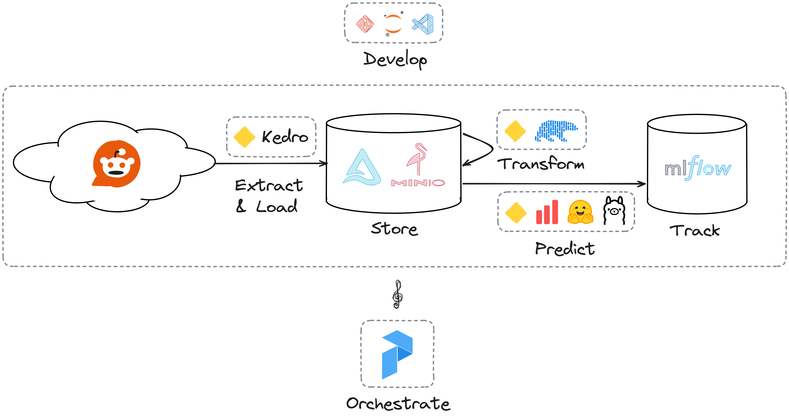

# From zero to MLOps: An open source stack to fight spaghetti ML

Material for the workshop "From zero to MLOps: An open source stack to fight spaghetti ML"
first delivered at EuroPython 2024 https://ep2024.europython.eu/session/from-zero-to-mlops-an-open-source-stack-to-fight-spaghetti-ml

## Outline

Approximate duration: 3 hours.

0. What is even MLOps? (10m)
1. Initial setting: Jupyter notebook, local files, everything mostly works! (20m)
2. Your local lakehouse with MinIO and Delta (10m)
3. Data and ML pipelines with Kedro (50m)
4. Break (15m)
5. Experiment tracking and model registry with MLFlow (20m)
6. Orchestration with Prefect (15m)
7. Scaling execution on a Ray cluster (15m)
8. Model monitoring with Evidently (15m)
9. Conclusions and buffer (25m)
